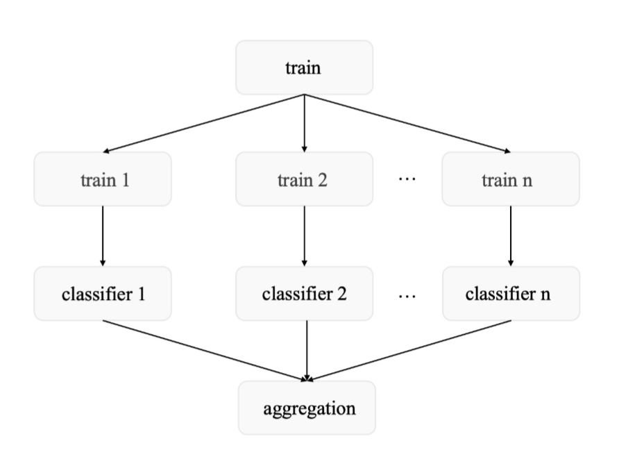
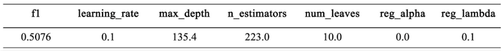

# Term Deposit Pattern Recognition
    
## Overview
This project aims to predict whether a client will subscribe to a bank term deposit using machine learning techniques.
- Task: Binary classification ```(y ∈ {0,1})```
- Goal: Maximize F1-score
- Evaluation:
  - Performance is measured on a hidden test set 
  - Only part of the test labels are accessible during development
 
💻 [Full Codes](./code.ipynb) <br>
📄 [Full Report](./report.pdf)

## Project Structure
```
├── EDA
├── Data Preprocessing
├── Model Training
├── Evaluation & Analysis
```

## 1. Data Exploration (EDA)
Through EDA, we identified a critical issue: <br>
```The dataset is highly imbalanced, with a ratio of approximately 1 : 8 between positive and negative classes.```

### 1.1 Problem of Imabalanced Dataset
In imbalanced datsets:
- One class dominates → model predicts majority class
- This causes:
      - Low recall for minority class
      - Unbalanced precision/recall trade-off

As a result: <br>
```Even if accuracy is high, F1-score remains low because it requires both precision and recall to be balanced.```

### 1.2 Modeling Strategy
This insight directly shaped our approach:
- ❌ Do not rely on accuracy
- ✅ Focus on F1-score optimization
- ✅ Design strategies specifically for class imbalance

Based on this, we explored two approaches:<br>
```
1. Resampling-based methods (SMOTE + ensemble) 
2. Class-weighted learning (LightGBM)
```
The entire modeling pipeline was built around solving this issue.

## 2. Data Preprocessing
We designed a comprehensive preprocessing pipeline tailored to the dataset, including missing value and outlier handling, feature encoding, normalization, and feature selection.

To keep this README concise, we highlight only the key design choices, while the full implementation can be found in the [full code](./code.ipynb).

### 2.1 Handle Missing Values
We observed missing values in several categorical features.
Rather than applying a single imputation strategy, we designed **feature-specific methods based on data distribution.**

#### ► Distribution-Based Imputation
For features with skewed distributions (e.g., ```job, marital, default, loan```):
- Mode imputation would over-amplify dominant categories
- This could distort the original data distribution<br>
👉 Therefore, we filled missing values by preserving the original category proportions

#### ► KNN-Based Imputation
For features with relatively balanced distributions (e.g., ```education, housing```):
- We applied KNN imputation, extending it to categorical data
```
# Pipeline
1. Label encode categorical features
2. Restore encoded NaN values
3. Apply KNNImputer
4. Round outputs → integer
5. Convert back to categorical values
```

### 2.2 Stepwise Feature Selection
After encoding categorical variables, the feature dimension increased significantly (~57 features), which could lead to overfitting and reduced interpretability.

To address this, we implemented a stepwise feature selection method.
```
# Core logic
while True:
    add feature with lowest p-value (< 0.05)
    remove feature with highest p-value (> 0.05)
    evaluate model performance
```

#### ► Implementation Details
- Statistical Criteria:
    - ```p-value (< 0.05)```: feature significance
    - ```AIC / BIC:``` trade-off between model fit and complexity
    - ```Adjusted R²```: performance with penalty for unnecessary features
- Model: OLS (Ordinary Least Squares) via ```statsmodels```

#### ► Results
The final selected features include
```
['emp.var.rate', 'default_0', 'poutcome_2', 'default_1', 'month_6', 'month_5', 'euribor3m', 'month_7', 'poutcome_0', 'poutcome_1', 'contact_0', 'cons.price.idx', 'contact_1', 'month_1', 'day_of_week_1', 'month_3', 'job_1', 'job_5', 'month_4', 'month_2', 'month_9', 'day_of_week_4', 'cons.conf.idx', 'campaign', 'job_8', 'job_7', 'job_3']
```
By feature selection, we:
- Reduced high-dimensional feature space (~57 → compact subset)
- Prevented overfitting
- Improved model interpretability


## 3. Model Training
From EDA, we identified that the dataset is highly imbalanced (~1:8).
To address this, we explored two fundamentally different strategies:
```
1. Resampling-based methods (balance the data)
2. Class-weighted learning (adjust model behavior)
```
We ultimately selected the second approach beacause of a higher F1 return, but the first approach provided meaningful insights and experimentation.<br>
Additionally, we performed ```threshold optimization``` and ```Baysian optimization``` for a better F1 score. <br>

### 3.1 [Approach 1] Resampling + Ensemble
Balancing the dataset using a single resampling step (e.g., SMOTE) may introduce bias, as one sampled dataset may not represent the full data distribution. <br>
Therefore, we decided to ```“Train multiple models on multiple resampled datasets”```


#### ► Method
```
1. Apply SMOTE (empirically chosen among various sampling methods)
2. Generate multiple resampled datasets
3. Train a model on each dataset
4. Aggregate predictions 
```
```
# pseudocode
for i in range(n):
    X_resampled, y_resampled = SMOTE(random_state=i)
    
    model_i = GradientBoostingClassifier(random_state=i)
    model_i.fit(X_resampled, y_resampled)
    
    models.append(model_i)

prob = average([model.predict_proba(X_test) for model in models])
```
* GradientBoostingClassifier was chosen emperically. <br>


#### ► Threshold Optimization
Instead of using default threshold (0.5), we optimized it for F1-score:
```
precision, recall, thresholds = precision_recall_curve(...)
f1 = 2 * (precision * recall) / (precision + recall)

best_threshold = thresholds[argmax(f1)]
y_pred = (prob > best_threshold)
```

### 3.2 [Approach 2] Class-Weighted Learning
Instead of modifying the data, we adjust the learning objective to ```assign higher weights to the samples of the minority class and lower weights to the majority class``` during the training process. .

#### ► Method
```
# pseudocode
model = LGBMClassifier(
    ...,
    is_unbalance=True
)
```

### 3.3 Hyperparamter Optimization
Using ```Bayesian opimization```, we chose the best hyperparmeter and F1 score.



